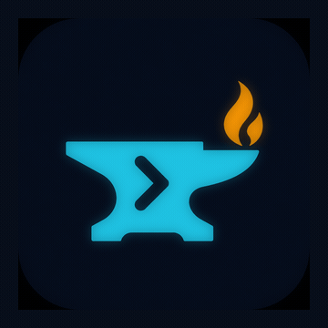
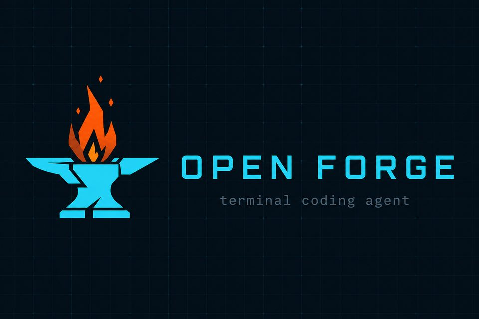
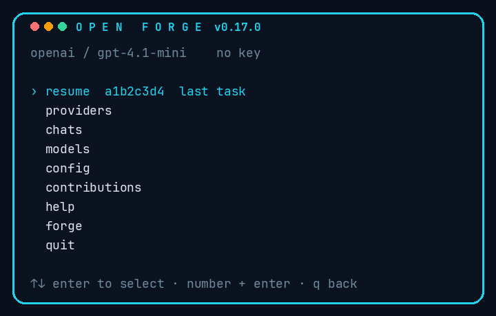
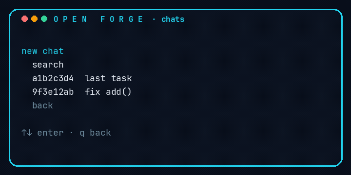
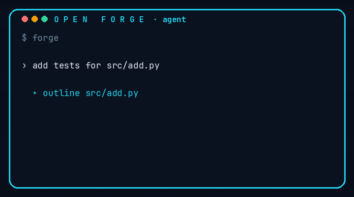

<div align="center">



# OPEN FORGE

**An open-source AI coding agent for the terminal.**

Bring your own key. Or bring no key — Ollama and llama.cpp work out of the box.
After every edit, Forge runs **integrated QA** until the suite is green.




Not affiliated with OpenCode or Anthropic.



</div>

`forge` or `forge menu` opens that window. Arrow keys or a number, then Enter. `q` goes back.

## Install

Python 3.10+. **Use a virtualenv.** Debian, Ubuntu, and Pop!_OS block system `pip`
(`externally-managed-environment`). Do not use `--break-system-packages`.

```bash
# Debian / Ubuntu / Pop!_OS — skip if `python3 -m venv` already works
sudo apt install -y python3-venv python3-full

git clone https://github.com/DarioDGR12/Forge-Code.git
cd Forge-Code
python3 -m venv .venv
source .venv/bin/activate
python -m pip install -U pip
pip install -e ".[dev]"

which forge
# must be …/Forge-Code/.venv/bin/forge

forge --version
# forge 0.19.0

forge
```

From a clone you can also run `./install.sh` (creates `.venv` and prints the binary path).

**Every new terminal**, activate first or call the binary by path:

```bash
source ~/Forge-Code/.venv/bin/activate    # then: forge
~/Forge-Code/.venv/bin/forge              # no activate
~/Forge-Code/.venv/bin/python -m forge_code
```

`forge --version` must print `forge 0.19.0`. If you see `forge vibe`, “marketplace”,
or `unrecognized arguments: menu` / `context`, that is a **different program** named
`forge`. `which forge` shows which one. Activate the venv (or use the paths above).

### OPEN FORGE (chats, providers, help)

<div align="center">



</div>

`forge` or `forge menu` opens the window. Arrow keys or a number, then Enter. `q` goes back.

1. **resume** → last chat (only if you already have one)
2. **providers** → pick Mistral / OpenAI / DeepSeek / Kimi / … → paste the API key → chat starts
3. **chats** → new, search, open / rename / delete a session
4. **models** → switch model
5. **config** → qa / bash / theme / quiet / language
6. **files** → last written files, open `files/`, peek, journal, last QA
7. **contributions** → recommend an improvement (opens mail to dariopro.1212@gmail.com — hit Send) or open the GitHub repo to contribute code
8. **help** → about, commands, doctor (API / Ollama / llama.cpp / cwd / context / files / journal), language
9. **forge** → open chat (if a key is already saved)

First run without a key prints a short setup and the provider list. Ollama needs no key.

Skip the menu: `forge chat`, `forge --repl`, `forge --resume ID`, `forge -c`, or `FORGE_MENU=0`.

Spanish: **help** → language → `es`, or `forge set lang es` (`FORGE_LANG` / `LANG=es_*` still win).

## Bring your own key

Two steps inside the menu (**providers** → paste key), or the same from the shell:

```bash
forge providers
forge set provider mistralai
forge set api sk-your-key
forge
```

In the REPL:

```
/set provider kimi
/api sk-your-key
```

`mistralai`, `moonshot`, `google`, `grok`, `claude`, and `chatgpt` are aliases.

Keys live in `~/.config/forge-code/credentials.json` (mode `600`). They only go to the provider you chose.

| Provider | Also | Env var |
| --- | --- | --- |
| `openai` | chatgpt | `OPENAI_API_KEY` |
| `anthropic` | claude | `ANTHROPIC_API_KEY` |
| `mistral` | mistralai, codestral | `MISTRAL_API_KEY` |
| `deepseek` | | `DEEPSEEK_API_KEY` |
| `kimi` | moonshot | `MOONSHOT_API_KEY` |
| `gemini` | google | `GEMINI_API_KEY` |
| `xai` | grok | `XAI_API_KEY` |
| `openrouter` | | `OPENROUTER_API_KEY` |
| `groq` | | `GROQ_API_KEY` |
| `together` `fireworks` `cerebras` `perplexity` `cohere` | | their `*_API_KEY` |
| `hf` `nvidia` `dashscope`/`qwen` `glm`/`zhipu` | | `HF_TOKEN` / `NVIDIA_API_KEY` / `DASHSCOPE_API_KEY` / `ZHIPUAI_API_KEY` |
| `minimax` `siliconflow` `deepinfra` `sambanova` `novita` `ark`/`doubao` `yi` `github` | | matching env |
| `ollama` `llamacpp` `lmstudio` `custom` | local, no key | optional |

`forge auth login mistral` still works (prompts for the key). `forge auth status` shows what is configured.

OpenAI-compatible and Anthropic responses stream token-by-token. Ctrl+C cancels.

```bash
forge set provider openai
forge set api sk-...
forge run "add an install section to the README"
```

## Local models

**Ollama**

```bash
ollama pull qwen2.5-coder:7b
forge set provider ollama
forge
```

**llama.cpp** (OpenAI-compatible server)

```bash
./llama-server -m qwen2.5-coder-7b.gguf --port 8080
forge auth login llamacpp --base-url http://127.0.0.1:8080/v1
```

**Company gateway / vLLM / LocalAI / LiteLLM**

```bash
forge auth login custom --base-url https://llm.internal.example/v1 --key "$TOKEN"
```

```bash
forge models
forge doctor
```

## Integrated QA

After the agent writes or edits a file, Forge detects the repo and runs:

| If it finds                 | It runs                 |
| --------------------------- | ----------------------- |
| pytest / `tests/test_*.py`  | `python -m pytest -q`   |
| `package.json` `test`/`lint`| `npm test` / `npm lint` |
| `Cargo.toml`                | `cargo test`            |
| `go.mod`                    | `go test ./...`         |
| `ruff.toml`                 | `ruff check`            |
| `[tool.mypy]`               | `mypy .`                |
| `Makefile` `test:`          | `make test`             |
| Python without tests        | `compileall`            |

Failures go back into the conversation. Standalone:

```bash
forge qa
# inside the REPL:
/qa
/qa off
```

Pin extra checks in `.forge/config.json`:

```json
{ "qa": { "auto": true, "timeout": 120, "extra": ["npm run typecheck"] } }
```

## Safety

- Paths are jailed to the workspace
- `.env`, keys, and credential filenames cannot be read or written
- `.forgeignore` + `.gitignore` hide vendor and secret trees from search
- Destructive bash (`rm -rf /`, `mkfs`, `curl | sh`, …) is rejected
- **plan** mode is read-only
- `/bash ask` prompts before each shell command (`FORGE_YES=1` auto-approves in CI)
- `/undo` and `forge undo` restore the last turn (git snapshot when possible)
- Ctrl+C cancels the current model/tool loop
- After edits, Forge runs language diagnostics (pyright/ruff, tsc, go vet) when those tools exist
- `fetch_url` is GET-only, http(s), size-capped, and rejects localhost / private hosts
- `git_commit` stages explicit paths only (no `-a`, amend, or hook skip)

## Commands

| Command | What it does |
| --- | --- |
| `forge` | OPEN FORGE menu (resume, providers, chats, models, config, files, contributions, help) |
| `forge menu` | Same as bare `forge` |
| `forge chat` | Skip the menu, open the chat |
| `forge --resume ID` | Continue a saved session |
| `forge -c` / `--continue` | Resume the latest session |
| `forge --model NAME` | Model or alias for this invocation |
| `forge --provider NAME` | Provider for this invocation |
| `forge run "task"` | One shot |
| `forge run --plan "task"` | One shot, read-only |
| `forge run -q "task"` | One shot, no transcript |
| `forge run --model fast "task"` | One shot with a model override |
| `forge run -` | One shot, task from stdin |
| `forge ask "question"` | Read-only Q&A (plan mode) |
| `forge run "task" --json` | Machine-readable result |
| `forge providers` | List built-in vendors |
| `forge set provider NAME` | Switch vendor (mistralai, deepseek, kimi, …) |
| `forge set api KEY` / `forge api KEY` | Save the key for the current vendor |
| `forge set lang auto\|en\|es` | Menu/REPL language (`auto` follows `LANG`) |
| `forge auth login <p>` | Same as set provider + prompt for key |
| `forge models` | Local + remote models |
| `forge qa` | Run the detected suite |
| `forge sessions` | List saved conversations |
| `forge sessions search QUERY` | Search titles and messages |
| `forge find QUERY` | Same as `sessions search` |
| `forge sessions export ID` | Write a markdown transcript |
| `forge sessions rm ID` | Delete a saved session |
| `forge tools` | List agent tools |
| `forge mcp` | List configured MCP servers |
| `forge init` | Scaffold `AGENTS.md`, `.forgeignore`, skills, commands |
| `forge doctor` | Health check (version, provider, API, Ollama, cwd, context, files, journal, last QA) |
| `forge undo` | Revert the last agent edits |
| `forge diff` | Last agent edits or current git diff |
| `forge commands` | List `.forge/commands/*.md` slash commands |
| `forge memory` | Print `.forge/memory.md` |
| `forge context` | Show `.forge/context.md` (stack, tests, layout, scripts, entry points) |
| `forge context --refresh` | Rescan the workspace and rewrite context |
| `forge terminal` | Print recent shell log (`.forge/terminal.md`) |
| `forge files` | Last written files (copy-friendly). `--copy` puts the last one on the clipboard |
| `forge open [path]` | Open `files/` (or a workspace path) in the file manager |
| `forge peek [path]` | Preview the last written file |
| `forge cat PATH` | Print a workspace file |
| `forge journal [query]` | Last turns (`.forge/journal.md`) |
| `forge last` | Latest journal entry |
| `forge why` | Last integrated QA report |
| `forge grep PATTERN [path]` | Search the workspace |
| `forge ls [glob]` | List files by glob |
| `forge tree [path]` | Directory tree |
| `forge status` | Compact workspace snapshot |
| `forge worktree add\|list\|remove` | Isolated git worktrees under `.worktrees/` |
| `forge alias` | List / set / remove model aliases |
| `forge budget` | Show the session cost/token cap |
| `forge share [ID]` | Write a markdown share under `.forge/shares/` |
| `forge shares` | List saved shares |
| `forge theme [name]` | Show or set the REPL color |
| `forge contribute` | Show how to recommend an idea or contribute code |
| `forge contribute recommend "…"` | Open mail to dariopro.1212@gmail.com (hit Send) |
| `forge contribute code` | Open the GitHub repo |
| `forge ci --task "…"` | CI / GitHub Actions (sets `FORGE_YES=1`) |

REPL: `/help` `/status` `/tools` `/model` `/provider` `/providers` `/set provider` `/set lang` `/api` `/mode` `/qa` `/compact` `/compact hard` `/cost` `/undo` `/diff` `/review` `/ask` `/retry` `/last` `/copy` `/copy path` `/files` `/peek` `/open` `/journal` `/turn` `/why` `/note` `/cat` `/grep` `/ls` `/new` `/rename` `/find` `/pin` `/alias` `/budget` `/share` `/shares` `/theme` `/quiet` `/commands` `/memory` `/context` `/terminal` `/bash` `/mcp` `/sessions` `/sessions rm` `/export` `/clear` `/exit`

Type `@src/file.py` (optional `:10-20`) to attach file contents to the prompt.

Multiline: end a line with `\` and keep typing. Tab completes slash commands.

## Tools

<div align="center">



</div>

`read_file` `write_file` `edit_file` `apply_patch` `list_dir` `tree` `glob` `grep` `outline` `bash` `git_status` `git_diff` `git_log` `git_commit` `todo_write` `todo_read` `fetch_url` `explore` `memory_read` `memory_write` `project_map` `terminal_read`

- **explore** — read-only nested search (plan-mode tools only; cannot recurse)
- **fetch_url** — public documentation, 80 KB cap, HTML stripped
- **git_commit** — `git add -- <paths>` then `git commit -m`
- **memory_*** — append-only facts in `.forge/memory.md` (no secrets)
- **outline** — list `def` / `class` / `fn` / `func` / `function` in a file without dumping it
- **grep** — optional `path` jails the search to one file or directory
- **project_map** — scan the repo and write `.forge/context.md` (stack, tests, layout, git, scripts, entry points). Auto-refreshes when `pyproject.toml` / `package.json` / etc. change
- **terminal_read** — recent `bash` commands and output in `.forge/terminal.md`
- **bash** — `cwd` is workspace-jailed and persists; `cd src && ls` actually runs in `src`

The system prompt loads `.forge/context.md`, nested `AGENTS.md` / `FORGE.md`, the shell cwd / last exit, and the last shell snippets every turn. `forge context --refresh` or `/context refresh` rebuilds the map. Secrets in the terminal log are redacted.

After writes, Forge prints the new code in a copy-friendly block, saves a copy under `files/` (open that folder in Files / Finder), appends `.forge/journal.md`, and stores the last QA in `.forge/last-qa.json`. `/copy` puts the last file on the clipboard. `/peek`, `/journal`, `/why`, and `/turn` replay those artifacts. `/diff` and `forge diff` replay the unified diff.

## Custom commands

Markdown files in `.forge/commands/*.md` become slash commands. `$ARGS` / `{{args}}` is the rest of the line. Built-in names (`help`, `diff`, `review`, …) cannot be overridden.

```bash
forge init
# writes explain, test, commit-msg
# then, in the REPL:
/explain the auth package
/test the login flow
/commit-msg
/ask where is the QA runner?
/retry
```

## Worktrees

```bash
forge worktree add hotfix
# → .worktrees/hotfix on branch forge/hotfix
cd .worktrees/hotfix
forge run "fix the failing tests"
cd -
forge worktree remove hotfix
```

Forge ignores `.worktrees/` in search. The branch is left in place after `remove`.

## Aliases and budget

Default aliases: `fast` → `gpt-4.1-mini`, `smart` → Claude Sonnet, `local` → `qwen2.5-coder:7b`.

```bash
forge alias set flash gpt-4.1-nano
# REPL: /model flash
#       /alias fast gpt-4.1-mini
#       /budget 0.50
#       /budget tokens 80000
#       /budget turn 0.10
#       /budget turn-tokens 8000
#       /budget off
#       /theme magenta
#       /quiet
#       /shares
```

Caps also accept `FORGE_MAX_COST`, `FORGE_MAX_TOKENS`, `FORGE_MAX_COST_TURN`, and `FORGE_MAX_TOKENS_TURN`. When a session or turn is over budget, Forge stops instead of calling the model again.

```json
{
  "aliases": { "fast": "gpt-4.1-mini" },
  "theme": "magenta",
  "quiet": false,
  "budget": {
    "max_usd": 0.5,
    "max_tokens": 80000,
    "max_usd_turn": 0.1,
    "max_tokens_turn": 8000
  }
}
```

`/share` and `forge share` write `.forge/shares/<session>.md`. `forge shares` lists them.

Search past chats with `forge find "auth"` or `/find auth`. `/pin` appends the last assistant reply (or a note) to `.forge/memory.md`.

`forge -c` resumes the latest session. `/new` starts a blank one; `/rename` titles it; `forge sessions rm ID` deletes it. `@path` in a prompt (REPL or `forge run`) attaches the file.

```bash
forge -c
forge run --model local --provider ollama "fix @src/add.py"
echo "summarize the repo" | forge run -
# REPL: /new hotfix   /rename auth review   /copy   /sessions rm ab12
```

## Hooks

Optional executable scripts in `.forge/hooks/`:

| Hook | When |
| --- | --- |
| `pre_edit` | Before `write_file` / `edit_file` / `apply_patch`. Non-zero exit blocks the edit. |
| `post_edit` | After a successful write in the turn |
| `post_turn` | After the agent finishes (including Ctrl+C) |

Environment: `FORGE_HOOK`, `FORGE_ROOT`, plus `FORGE_PATH` / `FORGE_PATHS` / `FORGE_TASK` when relevant.

```bash
mkdir -p .forge/hooks
cat > .forge/hooks/pre_edit <<'SH'
#!/bin/sh
echo "editing $FORGE_PATH"
SH
chmod +x .forge/hooks/pre_edit
```

## Skills

Markdown snippets in `.forge/skills/*.md` are injected into the system prompt (up to 8 files, 4 KB each).

```bash
mkdir -p .forge/skills
echo "Prefer pytest. Do not add new dependencies." > .forge/skills/python.md
```

## MCP

Add stdio MCP servers in `.forge/config.json`. Each server’s tools show up as `mcp_<name>_<tool>`. Clients are closed when the CLI or REPL exits.

```json
{
  "mcp": {
    "files": {
      "command": "npx",
      "args": ["-y", "@modelcontextprotocol/server-filesystem", "."]
    }
  }
}
```

```bash
forge mcp
# REPL: /mcp
```

## GitHub Actions

```yaml
- uses: actions/checkout@v4
- uses: ./.github/actions/forge
  with:
    task: "fix the failing tests"
    provider: openai
  env:
    OPENAI_API_KEY: ${{ secrets.OPENAI_API_KEY }}
```

Or `forge ci --task "…"` with `FORGE_YES=1`. A `/forge …` issue comment can drive the example workflow.

## Project files

| File | Purpose |
| --- | --- |
| `AGENTS.md` / `FORGE.md` | Instructions injected every turn (root and nested, capped) |
| `.forgeignore` | Hide paths from glob/grep/tree |
| `.forge/config.json` | Repo overlay (provider, QA, permissions, MCP) |
| `.forge/hooks/` | `pre_edit` / `post_edit` / `post_turn` scripts |
| `.forge/skills/*.md` | Extra system-prompt skills |
| `.forge/commands/*.md` | Custom slash commands |
| `.forge/memory.md` | Persistent notes (`memory_write`) |
| `.forge/context.md` | Generated project map (`project_map`) |
| `.forge/terminal.md` | Recent shell log (`bash` / `terminal_read`) |
| `.forge/journal.md` | Newest-first turn log (`/journal`, `/turn`, `forge last`) |
| `.forge/last-qa.json` | Last integrated QA report (`/why`, `forge why`) |
| `files/` | Copies of the last turn’s written files (`/copy`, `/peek`, `/files`, `forge files`) |
| `.forge/shell.json` | Persisted bash cwd |
| `.forge/shares/` | Markdown exports from `/share` |
| `.worktrees/` | Isolated checkouts from `forge worktree add` |
| `~/.config/forge-code/` | User config + credentials |

## Quick demo (no API)

```bash
python3 -m venv .venv
source .venv/bin/activate
pip install -e ".[dev]"
pytest
forge qa --repo examples/broken-add    # red on purpose
```

## License

[Apache License 2.0](LICENSE)
